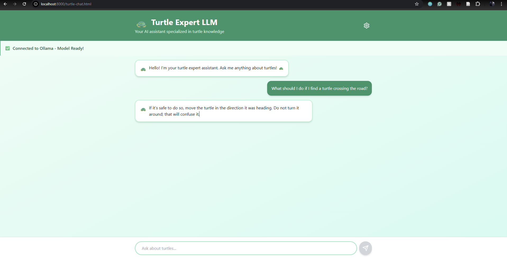

# Turtle-Llama-3 Fine-Tune
I successfully fine-tuned the Llama 3 8B model to further specialize in turtles.

## Project 🐢
* **Goal:** Create a model that gives accurate facts about turtles, avoiding generic AI hallucinations.
* **Method:** Used Unsloth for efficient LoRA fine-tuning on a Tesla T4 GPU (Google Colab).
* **Dataset:** Custom synthetic JSONL dataset containing species facts, biology, and care instructions for turtles.

## 💻 Local Web Interface 
I developed a custom chat interface so you can interact with the model locally without writing code.



### How to Run the App (Windows)
I included a `Start.bat` script that automates the setup (checks for dependencies, configures local server, and launches the UI).

1. **Download the Model:**
   * Download `model-unsloth.gguf` from my [Hugging Face](https://huggingface.co/YOUR_HF_USERNAME/turtle-llama-3-gguf).
   * **Rename it** to `model.gguf`.
   * Place it in the main folder (next to `Start.bat`).

2. **Launch:**
   * Double-click `Start.bat`.
   * It will automatically initialize the local inference server (Ollama) and open the chat window in your browser.

## 🚀 Quick Start (Python Script)
If you prefer running the raw Python inference script:

1. **Install Dependencies:**
   ```bash
   pip install -r requirements.txt
   
   
2. **Run Inference:**
   ```bash
   python run_inference.py

## Results (Before vs. After) 📊
The base model often gave vague or unreliable advice. Fine-tuning corrected this behavior.

### 🔴 Pre-Tuned Model 
**Prompt:** "What if a turtle is upside down?"
**Model Answer:** "If a turtle is upside down... it is important to turn the turtle over and **place it on its back**, so that it can breathe and move more."
*(Analysis: The model gives vague and unreliable advice.)*

### 🟢 Post-Tuned Model 
**Prompt:** "What if a turtle is upside down?"
**Model Answer:** "If a turtle is upside down, it cannot right itself. It will drown. If found upside down, **flip it back over gently by lifting from the back edge of its shell**, away from the head and legs, supporting its body to avoid twisting it, especially if it's a snapping turtle or in water."
*(Analysis: Correct safety instructions retrieved from the fine-tuning dataset.)*

## Links 🔗
* **Model Weights:** [Hugging Face](https://huggingface.co/Myrall/turtle-llama-3-gguf)
* **Dataset:** See `turtles_dataset.jsonl` in this repo.

